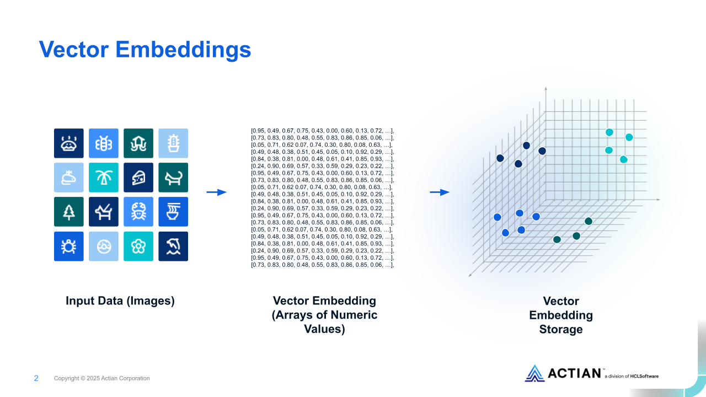
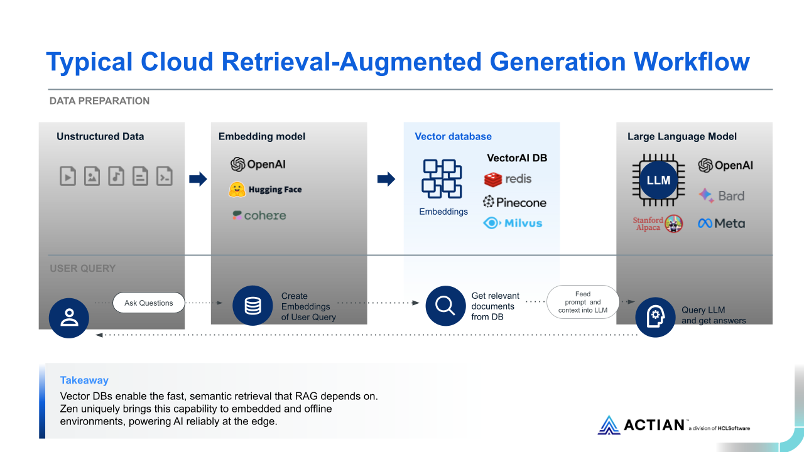

<p align="center">
  
  &nbsp;
</p>

<p align="center">
    <b>Actian VectorAI DB</b>
</p>

# Actian VectorAI DB and Python client

The Actian VectorAI DB and Python client. Please review the [Known Issues](#-known-issues) section before deploying.

## What is VectorAI DB?

Actian VectorAI DB is a vector database — a specialized database for AI applications that search by **meaning**, not just keywords. Think of it like this:
- Regular database: "Find products named 'laptop'"
- Vector database: "Find products *similar* to 'portable computer for students'"

**Common use cases:** RAG chatbots, semantic search, recommendation engines, anomaly detection.

**Important:** VectorAI DB does **not** include an embedding model. You need to bring your own (e.g. `sentence-transformers`, OpenAI embeddings). It handles storage and search — you handle the embeddings.

**About gRPC:** The database communicates over gRPC under the hood — you don't need to know anything about it. The Python client handles it for you. If you see gRPC in an error message, it's a connection issue, not a code issue.

### How vector embeddings work

Your data gets converted into arrays of numbers called **vectors** that capture the *meaning* of the original content. VectorAI DB stores and indexes these for fast semantic search.



### What Can You Build?

VectorAI DB is the storage-and-search layer. Pair it with an embedding model and you can build:

- **RAG (Retrieval-Augmented Generation)** — Chunk documents, embed them, retrieve relevant chunks to ground an LLM. Model: `all-MiniLM-L6-v2` (384d, COSINE). See [examples/rag/](./examples/rag/).



- **Semantic Search** — Index documents, products, or notes and search by meaning instead of keywords. Model: `all-MiniLM-L6-v2` (384d) or `all-mpnet-base-v2` (768d) for higher quality. See [examples/semantic_search.py](./examples/semantic_search.py).
- **Recommendation Engine** — Embed item descriptions or user preferences, find similar items via nearest-neighbor search. Model: `all-MiniLM-L6-v2` (384d). Same API pattern as search.
- **Image Similarity Search** — Embed images (and optionally text) with CLIP, search across modalities. Model: `openai/clip-vit-base-patch32` (512d).
- **Code Search** — Embed code snippets and docstrings, search codebases by natural language. Model: `microsoft/codebert-base` (768d).

### Popular Embedding Models

Pick a model, embed your data, store the vectors in VectorAI DB. All models below are available on Hugging Face and installable via `pip install sentence-transformers` or `pip install transformers`.

- [sentence-transformers/all-MiniLM-L6-v2](https://huggingface.co/sentence-transformers/all-MiniLM-L6-v2) — 384d, fast general-purpose text embeddings (great default choice)
- [sentence-transformers/all-mpnet-base-v2](https://huggingface.co/sentence-transformers/all-mpnet-base-v2) — 768d, higher quality text embeddings
- [BAAI/bge-small-en-v1.5](https://huggingface.co/BAAI/bge-small-en-v1.5) — 384d, strong quality-to-speed ratio
- [openai/clip-vit-base-patch32](https://huggingface.co/openai/clip-vit-base-patch32) — 512d, multimodal (text + images)
- [microsoft/codebert-base](https://huggingface.co/microsoft/codebert-base) — 768d, code understanding

### Supported platforms

* The VectorAI DB Docker image supports **Linux/amd64 (x86_64)** and **Linux/arm64 (Apple Silicon, AWS Graviton, etc.)**.
    * Supported on Windows using WSL2 (Docker Desktop or Podman Desktop).
    * Native support on macOS Apple Silicon (M1/M2/M3/M4) — no Rosetta or platform flags needed.
    * Docker will automatically pull the correct architecture when using the `latest` or `nightly-20260331` tags.

* The Python client package (`actian-vectorai`) is supported on all major platforms (Windows, macOS, and Linux).
    * Python 3.10 or higher is required.

## Features

- 🚀 **Async & Sync clients** — Full async/await with `AsyncVectorAIClient`, synchronous wrapper with `VectorAIClient`
- 🗂️ **Namespaced API** — `client.collections`, `client.points`, `client.vde`
- 🔍 **Type-safe Filter DSL** — Fluent `Field` / `FilterBuilder` API for payload filtering
- 🔀 **Hybrid Fusion** — Client-side RRF and DBSF for multi-query result merging
- 🛠️ **VDE Operations** — Engine lifecycle, snapshots, rebuilds, compaction
- ⚡ **Smart Batching** — Automatic request batching with `SmartBatcher`
- 📦 **Pydantic models** — Type hints and validation throughout
- 🎯 **gRPC + REST transport** — gRPC primary transport with REST fallback
- 🔐 **Persistent storage** — Production-grade data persistence

## Quick Install — Pull from DockerHub

The Docker image is multi-arch: Docker will automatically pull the correct build for your platform (amd64 or arm64).

1. Make sure you have [Docker](https://docs.docker.com/get-docker/) installed.

2. Clone this repository.

3. Start the database:

```bash
   docker compose up
```

   Or run in the background:

```bash
   docker compose up -d
```

  The database will be available at `localhost:50051`. The docker-compose.yml file handles the base config required.

4. To stop the container:

```bash
   docker compose down
```

## Quick Setup (macOS / Linux)

**Step 1:** Clone this repo and have Docker Desktop running.

**Step 2:** Run `docker compose up` in the root folder. Docker auto-selects the correct image for your architecture (Intel or Apple Silicon).

**Step 3:** In a new terminal, create and activate a Python virtual environment:

```bash
python3 -m venv .venv
source .venv/bin/activate
```

**Step 4:** Install the VectorAI DB Python client:

```bash
pip install ./actian_vectorai-0.1.0b2-py3-none-any.whl
```

**Step 5:** Validate by running `python examples/quick_start.py`

## 📥 Docker container installation — with the .tar image file (not included in this repository)

Architecture-specific image archives are available:

```bash
# For ARM64 (Apple Silicon, Graviton, etc.)
docker image load -i DOCKER_ActianVectorAI-arm64-nightly-20260331.tar

# For x86_64 / AMD64
docker image load -i DOCKER_ActianVectorAI-x64-nightly-20260331.tar
```

### Container ports and volumes

The container exposes port `50051` and stores its logs and persisted collections in the `/data` directory, which you should map to a host directory to persist data outside the container.

**Port conflict?** If port `50051` is already in use, change the host port in the compose file:
```yaml
ports:
  - "50052:50051"  # Use any free port on the left side
```
Then connect with `VectorAIClient("localhost:50052")`.

### Deploy container with Docker run

To deploy the container using `docker run`:

```bash
docker run -d --name vectoraidb -v ./data:/data -p 50051:50051 williamimoh/actian-vectorai-db:latest
```

### Deploy container with Docker compose

To deploy the container using `docker compose`, create a `docker-compose.yml` file with this service definition and start it with `docker compose up`.

```yaml
services:
    vectoraidb:
       image: williamimoh/actian-vectorai-db:latest
       container_name: vectoraidb
       ports:
         - "50051:50051"
       volumes:
         - ./data:/data
       restart: unless-stopped
       stop_grace_period: 2m
```

_Note: Collections and logs are persisted under the mounted /data directory_

### Examine container logs

The VectorAI DB server writes useful informational messages and errors to its log. These logs are often the best place to start when diagnosing failed requests or unexpected behavior.

You can access the server logs in two ways:

- Use `docker logs <container-name>` to stream or inspect the container logs directly.
- Read the log file at `/data/vde.log` from the host directory you mapped to `/data` when starting the container.

## 📥 Python environment setup

Here's how to create and activate a virtual environment:

**Linux/macOS:**
```bash
python -m venv .venv
source .venv/bin/activate
```

**Windows (Command Prompt):**
```cmd
python -m venv .venv
.venv\Scripts\activate.bat
```

**Windows (PowerShell):**
```powershell
python -m venv .venv
.venv\Scripts\Activate.ps1
```

## 📥 Install Python client

Install the Python client with pip:

```bash
pip install actian_vectorai-0.1.0b2-py3-none-any.whl
```

Or install from PyPI:

```bash
pip install actian-vectorai
```

**_For detailed API documentation, see [docs/api.md](./docs/api.md)._**

## 🚀 Quickstart

Sync client and async client quickstarts are available.

### Sync client

```python
from actian_vectorai import VectorAIClient, VectorParams, Distance, PointStruct

with VectorAIClient("localhost:50051") as client:
    # Health check
    info = client.health_check()
    print(f"Connected to {info['title']} v{info['version']}")

    # Create collection
    client.collections.create(
        "products",
        vectors_config=VectorParams(size=128, distance=Distance.Cosine),
    )

    # Insert points
    client.points.upsert("products", [
        PointStruct(id=1, vector=[0.1] * 128, payload={"name": "Widget"}),
        PointStruct(id=2, vector=[0.2] * 128, payload={"name": "Gadget"}),
        PointStruct(id=3, vector=[0.3] * 128, payload={"name": "Gizmo"}),
    ])

    # Search
    results = client.points.search("products", vector=[0.15] * 128, limit=5)
    for r in results:
        print(f"  id={r.id}  score={r.score:.4f}  payload={r.payload}")

    # Clean up
    client.collections.delete("products")
```

### Async client

```python
import asyncio
from actian_vectorai import AsyncVectorAIClient, VectorParams, Distance, PointStruct

async def main():
    async with AsyncVectorAIClient("localhost:50051") as client:
        await client.collections.create(
            "demo",
            vectors_config=VectorParams(size=128, distance=Distance.Cosine),
        )
        await client.points.upsert("demo", [
            PointStruct(id=1, vector=[0.1] * 128, payload={"tag": "hello"}),
        ])
        results = await client.points.search("demo", vector=[0.1] * 128, limit=5)
        print(results)
        await client.collections.delete("demo")

asyncio.run(main())
```

**Note:** To use the sync `VectorAIClient` in async contexts (e.g., MCP servers, FastAPI), wrap calls with `asyncio.to_thread()`. For fully async code, use `AsyncVectorAIClient` instead.

## What Can I Do With Retrieved Vectors?

Once you retrieve results, the `payload` is where your real data lives. Some ideas:
- **RAG:** Feed the retrieved text chunks into an LLM (OpenAI, Ollama, etc.) as context
- **Recommendations:** Use the returned IDs to look up items in your own database
- **Anomaly detection:** Flag results whose `score` falls below a similarity threshold
- **Note-taking / personal search:** Store notes as vectors, search them by meaning later

Results look like this:
```python
for result in results:
    print(result.score)    # similarity score
    print(result.payload)  # your original data, e.g. {"text": "...", "source": "..."}
```

## 📚 Core API

The client uses a **namespaced architecture** — operations are grouped by domain:

| Namespace | Access | Description |
|-----------|--------|-------------|
| **Collections** | `client.collections` | Create, list, delete, update collections |
| **Points** | `client.points` | CRUD, search, query, payload, indexing |
| **VDE** | `client.vde` | Engine lifecycle, snapshots, rebuilds, compaction |

### Collection management

```python
client.collections.create("my_col", vectors_config=VectorParams(size=128, distance=Distance.Cosine))
client.collections.list()                     # -> ["my_col", ...]
client.collections.get_info("my_col")         # -> CollectionInfo
client.collections.exists("my_col")           # -> True
client.collections.delete("my_col")
```

### Point operations

```python
# Upsert
client.points.upsert("col", [PointStruct(id=1, vector=[...], payload={...})])

# Get by ID
points = client.points.get("col", ids=[1, 2, 3])

# Delete
client.points.delete("col", ids=[1, 2])

# Count
n = client.points.count("col")

# Bulk upload with auto-batching
total = client.upload_points("col", points, batch_size=256)
```

### Search operations

```python
# Vector similarity search
results = client.points.search("col", vector=[...], limit=10)

# Filtered search
from actian_vectorai import Field, FilterBuilder
f = FilterBuilder().must(Field("price").lte(100.0)).build()
results = client.points.search("col", vector=[...], limit=10, filter=f)

# Batch search
batch = client.points.search_batch("col", [
    {"vector": query1, "limit": 5},
    {"vector": query2, "limit": 10},
])
```

### VDE operations

```python
client.vde.open_collection("col")
client.vde.get_state("col")          # -> CollectionState.READY
client.vde.get_stats("col")          # -> CollectionStats
client.vde.flush("col")
client.vde.save_snapshot("col")
client.vde.rebuild_index("col")
client.vde.compact_collection("col")
client.vde.close_collection("col")
```

## 🔍 Filter DSL

Type-safe filter building for payload queries:

```python
from actian_vectorai import Field, FilterBuilder, has_id, is_empty

# Equality
f = FilterBuilder().must(Field("category").eq("electronics")).build()

# Range
f = FilterBuilder().must(Field("price").between(100.0, 500.0)).build()

# Combined conditions
f = (
    FilterBuilder()
    .must(Field("category").eq("electronics"))
    .must(Field("price").lte(500.0))
    .must_not(Field("deleted").eq(True))
    .build()
)

# Operator syntax
cond = Field("category").eq("electronics") & Field("price").lte(500.0)
f = cond.build()

# Use in search
results = client.points.search("products", vector=query_vector, limit=10, filter=f)
```

## 🔀 Hybrid Fusion

Combine results from multiple search queries:

```python
from actian_vectorai import reciprocal_rank_fusion, distribution_based_score_fusion

dense  = client.points.search("col", vector=dense_query,  limit=50)
sparse = client.points.search("col", vector=sparse_query, limit=50)

# Reciprocal Rank Fusion
fused = reciprocal_rank_fusion([dense, sparse], limit=10, weights=[0.7, 0.3])

# Distribution-Based Score Fusion
fused = distribution_based_score_fusion([dense, sparse], limit=10)
```

## 📖 Examples

### 🌟 Featured: End-to-End RAG Example

**New to vector databases?** Start here! The RAG example shows how VectorAI DB integrates into a complete AI application:

```bash
# Install dependencies
pip install -r examples/rag/requirements.txt

# Run the RAG example
python examples/rag/rag_example.py
```

See [examples/rag/README.md](./examples/rag/README.md) for a detailed walkthrough of building a Retrieval-Augmented Generation application.

### Other Examples

```bash
# Quick start - recommended starting point
python examples/quick_start.py

# Semantic search with filtering
python examples/semantic_search.py

# Async operations
python examples/async_example.py

# Batch operations
python examples/batch_upsert.py
```

## 📊 Storage

VectorAI DB uses persistent storage as the default backend. This provides:

- ✅ Production-grade persistence
- ✅ Transactional safety
- ✅ High-performance I/O

## 🔧 Configuration

### HNSW parameters

```python
from actian_vectorai import VectorParams, Distance, HnswConfigDiff

client.collections.create(
    "vectors",
    vectors_config=VectorParams(size=128, distance=Distance.Cosine),
    hnsw_config=HnswConfigDiff(
        m=32,              # Edges per node (default: 16)
        ef_construct=256,  # Build-time neighbors (default: 200)
    ),
)
```

### Distance metrics

- `Distance.Cosine` — Cosine similarity (default, recommended for normalized vectors)
- `Distance.Euclid` — L2 distance
- `Distance.Dot` — Dot product

## 📦 Dependencies

| Package | Version | Purpose |
|---------|---------|---------|
| `grpcio` | >= 1.70.0 | gRPC transport |
| `protobuf` | >= 5.29.2 | Protocol buffer serialisation |
| `pydantic` | >= 2.10.0 | Data models and validation |
| `numpy` | >= 1.26.0 | Vector array operations |

## 📊 Current Status (v0.1.0b2)

**44 of 67** SDK methods are fully available against Actian VectorAI DB v1.0.0.
The remaining 23 methods are implemented client-side and will activate
once the server adds support. See the full
[Server Availability Status](docs/api.md#server-availability-status) for details.

### Verified on live server (Actian VectorAI DB 1.0.0 / VDE 1.0.0)

- `has_id` filters validated for both numeric IDs and UUID IDs
- Named-vector collections validated end-to-end
- Dynamic `create_field_index` remains server-side `UNIMPLEMENTED`
- Sparse-vector and multi-dense-vector write paths remain under server development

## 🐞 Known issues

- CRTX-202: Closing or deleting collections while read/write operations are in progress is not supported.
- CRTX-232: scroll API uses the term cursor to indicate the offset.
- CRTX-233: get_many API does not return the vector IDs.

## 📄 License

Proprietary — Actian Corporation

---

<p align="center">
  <b>Copyright © 2025-2026 Actian Corporation. All Rights Reserved.</b>
</p>


